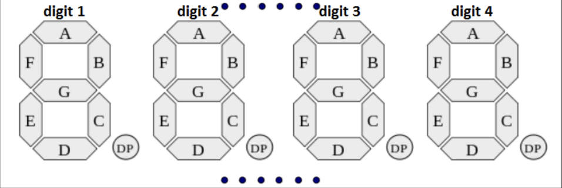

# Ticki Radio Alarm


A web-based internet radio player for Raspberry Pi with alarm functionality.

## Features

- Web interface for controlling the radio
- Play/Stop controls
- Alarm functionality to start playing at a specific time

## Prerequisites

- Raspberry Pi 3 Model A+
- 8GB (minimum) microSD card
- Raspberry Pi Imager (for flashing the SD card)

## Setup Instructions

### 1. Prepare the Raspberry Pi

1. Download and install [Raspberry Pi Imager](https://www.raspberrypi.com/software/)
2. Insert your microSD card into your computer
3. Open Raspberry Pi Imager and:
   - Choose OS: Select "Raspberry Pi OS Lite (32-bit)"
   - Choose Storage: Select your microSD card
   - Click on settings (gear icon) and:
     - Enable SSH
     - Set a username and password
     - Configure your WiFi settings
   - Click "Write" and wait for the process to complete
4. Insert the microSD card into your Raspberry Pi and power it on
5. Find your Raspberry Pi's IP address (you can use your router's admin panel or `nmap -sn 192.168.1.0/24` on your network)

### 2. Copy the repository to your Raspberry Pi

1. Make sure you have SSH access to your Raspberry Pi.

1. Use `sudo raspi-config` to enable I2C, SPI and audio output.

1. Use the sync script to copy the repository to your Raspberry Pi:

```bash
./sync.sh
```

### 3. Setup on Raspberry Pi

1. Install display dependencies as detailed on https://luma-oled.readthedocs.io/en/latest/software.html


1. Setup the virtual environment and install the dependencies:

```bash
cd ticki
python3 -m venv venv
source venv/bin/activate
pip install -r requirements.txt
```

1. Create a systemd service to run the application:

```bash
sudo cp ticki.service /etc/systemd/system/ticki.service
sudo systemctl daemon-reload
sudo systemctl enable ticki
sudo systemctl start ticki
```

## Usage

Use the web interface to:

- Play/Stop the radio
- Set an alarm time

Access the web interface under <http://<raspberry-pi-ip:8888>

## Adding More Stations

To add more stations, modify the `current_station` dictionary in `app.py` with additional station URLs.

## 7 Segment Projector

The clock can be configured to control a projector that projects the time to the ceiling using a 7-segment display.

The 7-segment display was retrofitten from an old store-bought alarm clock. It is controlled via SPI using a custom protocol.

The displayed time consists of 4 digits (hour tens, hour ones, minute tens and minute ones), each with 7 segments that can be enabled or disabled. By convention, the segments of each digit are labeled A-G as shown below:



To update the display, packets of 5 bytes are sent via SPI. The packets use the following protocol to configure the enabled segments:

| Byte | Bit 7 | Bit 6 | Bit 5 | Bit 4 | Bit 3 | Bit 2 | Bit 1 | Bit 0 |
|------|--------|--------|--------|--------|--------|--------|--------|--------|
| 0    | 1 | 0 | 1 | 0 | 1 | 1 | 0 | 0 |
| 1    | MM_ONES.E | MM_ONES.A | MM_ONES.B | MM_ONES.C | MM_ONES.D | 1 | MM_ONES.F | MM_ONES.G |
| 2    | MM_ONES.E | MM_TENS.A | MM_TENS.B | MM_TENS.C | MM_TENS.D | 1 | MM_TENS.F | MM_TENS.G |
| 3    | HH_TENS.E | HH_ONES.A | HH_ONES.B | HH_ONES.C | HH_ONES.D | 1 | HH_ONES.F | HH_ONES.G |
| 4    | HH_ONES.E | HH_TENS ⁽*⁾ | HH_TENS ⁽*⁾ | 0 | 0 | 0 | 0 | HH_TENS ⁽*⁾ |

**\*** The Hour tens segments cannot be controlled individually, bits 6 to 0 of the last byte are:

- `0b0000000` when no hour ten should be displayed (e.g. 1:00)
- `0b1000001` when the hour tens are "1" (e.g. 10:00)
- `0b1100000` when the hour tens are "2" (e.g. 20:00)

For example, the following packet will configure the display to display **0:01**

`10101100 00110100 01111110 11111110 10000000` \
(`0xAC 0x34 0x7E 0xFE 0x80` in hex notation)

### Pinout

| Wire | Signal |
| ---- | --- |
| Red | MISO |
| Grey1 | Clock |
| Grey2 | Enable |
| Grey3 | GND |
| Grey4 | 3.3V |
| Grey5 | Unused |

## Optional: Deploy with Docker

### 1. Build and Deploy the Application

On your development machine:

1. Build and save the Docker image:

```bash
docker buildx create --use
docker buildx build --platform linux/arm/v7 -t raspi-ticki --load . && docker save raspi-ticki > raspi-ticki.tar
scp raspi-ticki.tar ticki:~
```

1. On the Raspberry Pi, load and run the image:

```bash
sudo docker load < raspi-ticki.tar
rm raspi-ticki.tar

# Run the container
docker run -d \
  --name ticki \
  --restart unless-stopped \
  --dns 8.8.8.8 \
  --dns 8.8.4.4 \
  -p 8888:8888 \
  --device /dev/snd \
  --group-add audio \
  raspi-ticki
```

### Troubleshooting

1. If you get audio permission errors:

```bash
# Add your user to the audio group
sudo usermod -aG audio $USER
sudo usermod -aG audio root
```

1. If the container fails to start:

```bash
# Check container logs
docker logs radio
```
